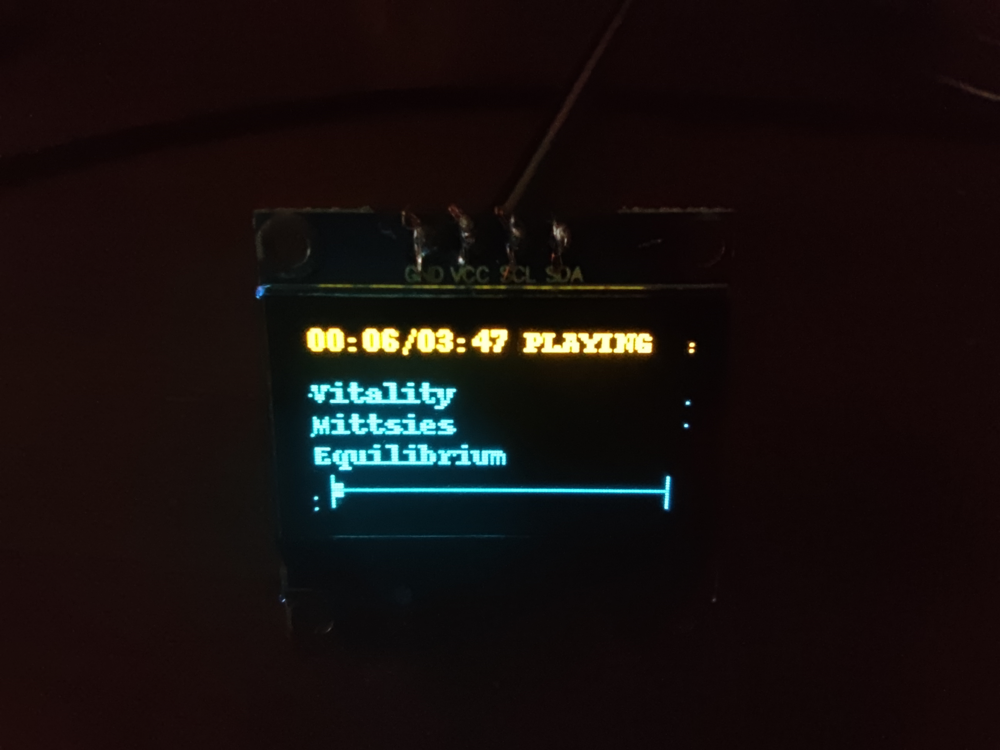

# RaspberryPi Spotify OLED Display

This application will display currently played track on SSD1306 OLED display connected to RaspberryPi.

Displayed stuff:

* Current track/album/artist (in case it's too long for screen, it will scroll)
* Track time and progress
* Current status (playing/stopped)
* Progress bar



## How to run

First, you have to create an application in your Spotify dashboard: <https://developer.spotify.com/dashboard/applications>

After you've done that, go to the app page and look for Client ID and Client Secret. You'll also need redirect URI, i'm using `http://localhost:16969/callback` because i have literally no clue what it's used for and it just works.

After that, install dependencies required for this app:

```bash
# this should be in repo and since Pillow uses C libs, it's probably better to install it that way
sudo apt install python3-pil python3-pip
# get the rest of dependencies with pip
pip3 install spotipy schedule adafruit-circuitpython-ssd1306
```

Then, i recommend creating a script that'll set environmental variables for Spotipy so it'll run. I'm using something like this:

```bash
#!/bin/sh
# Setup the environment for Spotipy
export SPOTIPY_CLIENT_ID='YOUR_CLIENT_ID'
export SPOTIPY_CLIENT_SECRET='YOUR_CLIENT_SECRET'
export SPOTIPY_REDIRECT_URI='http://localhost:16969/callback'

# Note: change the paths if necessary.
# cd to the directory you'll want to keep the cache and logs it.
# make sure you have write permissions there, otherwise it won't work
# and spotipy will keep asking for API key.
cd /home/pi/SpotifyOLED
python app.py
```

After that, give this script permissions to run (assuming you saved it as `run.sh` -> `chmod +x run.sh`), and **RUN IT FOR THE FIRST TIME MANUALLY**.
Then, check the terminal window - you should see a message saying `Go to the following URL` - copy and paste this URL to your browser, and when it finishes loading (and it **will** fail if you've set the redirect URI to `localhost`, so don't worry about it, it's perfectly fine) copy the URL from browser and paste it to the terminal. After that, there should be `.cache` file created with your API key, and the script should start running normally.

### How to run at boot?

Edit `/etc/rc.local` as superuser with your favourite editor. You'll probably see something like this there:

```bash
# Print the IP address
_IP=$(hostname -I) || true
if [ "$_IP" ]; then
  printf "My IP address is %s\n" "$_IP"
fi

exit 0
```

Remove the `exit 0` line, and add this instead (obviously change the path, if it's different for you):

`bash -c '/home/pi/SpotifyOLED/run.sh > /home/pi/SpotifyOLED/stdout.log 2>&1' &`

This will run the script in background, redirecting the standard output and standard error output to `/home/pi/SpotifyOLED/stdout.log` file (in case there's some critical error, it'll be there instead of going nowhere) - if the app crashes, please provide the message from this file in issue report.

There's also log in `spotify_display.log` file, which should be in script working directory. In case something is going wrong with Spotify API, all the messages will go there. If you wanna diagnose the issues in detail, change the log level in `app.py` from `INFO` to `DEBUG`
